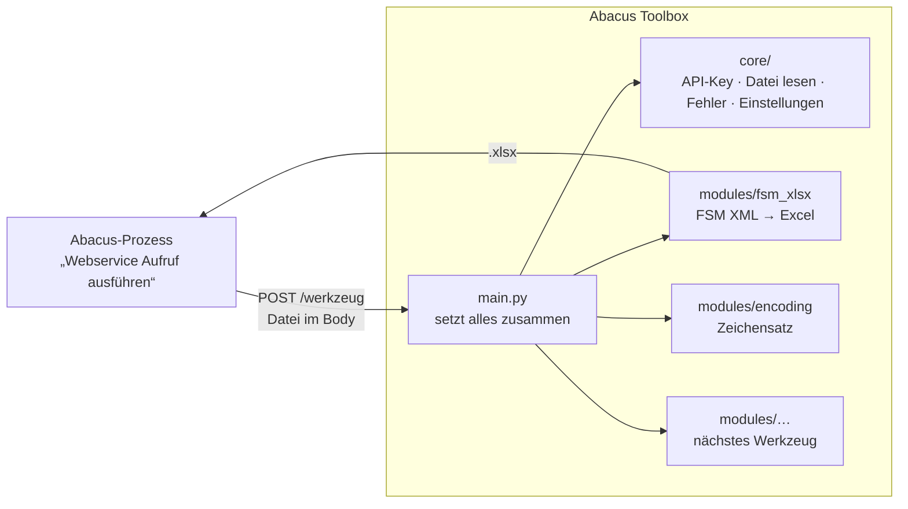

# Abacus Toolbox

Ein REST-Service mit **Werkzeugen für Aufgaben, die Abacus nicht selbst erledigt**: Dateien umwandeln,
aufbereiten, prüfen. Statt für jede Aufgabe ein eigenes Programm zu bauen und zu verteilen, läuft **ein** Dienst
mit mehreren Endpunkten. Ein neues Werkzeug ist ein neues Modul, Installation und Aufruf bleiben gleich.

Aufgerufen wird der Service aus einem **Abacus-Prozess** mit dem Baustein „Webservice Aufruf ausführen“:
Datei als Request-Body schicken, Ergebnis als Datei zurückbekommen. Er funktioniert mit jedem HTTP-Client.

**Repository:** <https://github.com/doodelidodo/abacus-toolbox>

```
Abacus / Client  ──POST Datei──►  Abacus Toolbox  /<werkzeug>  ──►  Ergebnis-Datei zurück
```

## Werkzeuge

| Werkzeug | Modul | Endpunkt | Wofür | Anleitung |
|---|---|---|---|---|
| **FSM XML → Excel** | `fsm_xlsx` | `POST /fsm/xml-to-xlsx` | SAP-FSM-XML (Zeiterfassungen `timeEfforts`, Spesen `expenses`) in eine flache Excel-Tabelle umwandeln | [docs/werkzeug-fsm-xlsx.md](docs/werkzeug-fsm-xlsx.md) |
| **Zeichensatz umwandeln** | `encoding` | `POST /text/convert-encoding` | Textdateien (CSV, TXT, XML …) z.B. von UTF-8 nach ANSI umwandeln, Zeilenenden vereinheitlichen | [docs/werkzeug-encoding.md](docs/werkzeug-encoding.md) |

Welche Werkzeuge ein Kunde bekommt, lässt sich pro Installation einstellen (`ENABLED_MODULES`, siehe
[Einstellungen](#einstellungen)). Ein neues Werkzeug hinzufügen: [docs/neues-werkzeug.md](docs/neues-werkzeug.md).

---

## Inhalt

1. [Aufbau](#aufbau)
2. [Repository-Struktur](#repository-struktur)
3. [Betriebsvarianten](#betriebsvarianten)
4. [Schnellstart (lokal mit Docker)](#schnellstart-lokal-mit-docker)
5. [API: gemeinsame Regeln](#api-gemeinsame-regeln)
6. [Einstellungen](#einstellungen)
7. [Sicherheit und Datenschutz](#sicherheit-und-datenschutz)
8. [Weiterführende Anleitungen](#weiterführende-anleitungen)

---

## Aufbau



| Teil | Ort | Aufgabe |
|---|---|---|
| **Zusammenbau** | `app/main.py` | Erstellt die App, hängt die aktiven Werkzeuge ein, allgemeine Endpunkte (`/health`, `/modules`, `/debug/echo`) |
| **Kern** | `app/core/` | Gemeinsam für alle Werkzeuge: Einstellungen, API-Key-Prüfung, Datei aus dem Request lesen (roh oder Formular, mit Grössenlimit), Datei zurückgeben, einheitliche Fehlermeldungen |
| **Werkzeuge** | `app/modules/<name>/` | Ein Ordner pro Werkzeug mit `router.py` (Endpunkte) und der eigentlichen Logik |
| **FSM-Konverter** | `converter/xml_to_xlsx.py` | Umwandlungslogik des FSM-Werkzeugs, auch eigenständig als Kommandozeilen-Tool nutzbar |

Technik: Python 3.12, [FastAPI](https://fastapi.tiangolo.com/), [openpyxl](https://openpyxl.readthedocs.io/),
[defusedxml](https://github.com/tiran/defusedxml). Der gleiche Code läuft in allen Betriebsvarianten
(Windows-Dienst, Docker, AWS Lambda).

## Repository-Struktur

```
.
├── app/
│   ├── main.py                    Zusammenbau, allgemeine Endpunkte
│   ├── core/                      gemeinsame Bausteine
│   │   ├── settings.py              Einstellungen (Umgebungsvariablen), Version
│   │   ├── security.py              API-Key-Prüfung
│   │   └── http.py                  Datei lesen/zurückgeben, ToolError
│   └── modules/                   Werkzeuge
│       ├── __init__.py              Verzeichnis der verfügbaren Werkzeuge
│       ├── fsm_xlsx/                FSM XML → Excel
│       └── encoding/                Zeichensatz umwandeln
├── converter/                     FSM-Konverter + Feldkonfiguration
│   ├── xml_to_xlsx.py
│   └── xml_to_xlsx_config.json
├── samples/                       Anonymisierte Beispiel-XMLs (keine echten Daten)
├── docs/                          Anleitungen: Werkzeuge, Betrieb, Abacus, Fehlersuche, neues Werkzeug
├── windows/                       Betrieb als Windows-Dienst (ohne Docker)
│   ├── service.py                   Dienst-Programm
│   ├── build-windows-service.ps1    baut .exe + Installations-ZIP
│   ├── install-service.ps1          installiert/aktualisiert den Dienst (prüft vorher den Port)
│   ├── uninstall-service.ps1
│   └── INSTALLATION.txt             Kurzanleitung, liegt in der ZIP
├── Dockerfile                     Container (Docker, Linux-Server, Azure Container Apps …)
├── docker-compose.yml             lokaler Start mit Docker
├── Dockerfile.lambda              Container-Variante für AWS Lambda
├── deploy-aws.ps1 / remove-aws.ps1  Bereitstellung auf AWS Lambda (Zürich) / wieder entfernen
├── test.ps1                       schickt alle Beispiel-XMLs an das FSM-Werkzeug
└── requirements.txt               Python-Abhängigkeiten
```

## Betriebsvarianten

| Variante | Geeignet wenn … | Kosten | Anleitung |
|---|---|---|---|
| **Windows-Dienst** | Abacus läuft auf einem Windows-Server (z.B. Azure-VM). Der Dienst läuft auf demselben Server und ist nur lokal erreichbar. | keine | [docs/betrieb-windows-dienst.md](docs/betrieb-windows-dienst.md) |
| **Docker** | Test auf dem eigenen Rechner, Linux-Server oder eine Container-Plattform (z.B. Azure Container Apps) | je nach Plattform | [docs/betrieb-docker.md](docs/betrieb-docker.md) |
| **AWS Lambda** | Der Service soll zentral im Internet erreichbar sein (HTTPS + API-Key), ohne eigenen Server | wenige Rappen pro Monat | [docs/betrieb-aws-lambda.md](docs/betrieb-aws-lambda.md) |

Die Einrichtung in Abacus ist für alle Varianten und Werkzeuge gleich, nur die Adresse unterscheidet sich:
[docs/abacus.md](docs/abacus.md).

## Schnellstart (lokal mit Docker)

Voraussetzung: [Docker Desktop](https://www.docker.com/products/docker-desktop/) läuft.

```powershell
git clone https://github.com/doodelidodo/abacus-toolbox.git
cd abacus-toolbox
docker compose up -d --build
```

Danach:

- **Swagger-Oberfläche mit allen Werkzeugen:** <http://localhost:8000/docs>. Dort lässt sich jedes Werkzeug direkt im Browser ausprobieren.
- **Healthcheck:** <http://localhost:8000/health> · **Aktive Werkzeuge:** <http://localhost:8000/modules>
- **Beispiel-XMLs in Excel umwandeln:** `.\test.ps1` → Ergebnisse in `output\`
- **Einzeln per Kommandozeile** (in PowerShell `curl.exe`, nicht `curl`):
  ```powershell
  curl.exe --data-binary "@samples\1001_20260911081138_timeEfforts.xml" `
    "http://localhost:8000/fsm/xml-to-xlsx?filename=1001_20260911081138_timeEfforts.xml" -o ergebnis.xlsx
  ```

Stoppen: `docker compose down` · Logs: `docker compose logs -f`

## API: gemeinsame Regeln

Alle Werkzeuge funktionieren nach demselben Muster. Die Einzelheiten stehen in der Anleitung des jeweiligen
Werkzeugs und interaktiv unter `/docs`.

- **Anfrage:** `POST`, die Datei als **Request-Body** (so arbeitet der Abacus-Baustein). Wird die Datei stattdessen als
  Formular (`multipart/form-data`) geschickt, nimmt der Service die erste Datei daraus.
- **Query `filename`:** Name der Eingabedatei. Die Antwort bekommt denselben Namen mit passender Endung.
- **Header `X-API-Key`:** nur nötig, wenn ein API-Key eingerichtet ist.
- **Antwort bei Erfolg:** `200` mit der Ergebnis-Datei als Download (`Content-Disposition` mit Dateiname) und
  werkzeugspezifischen `X-…`-Headern.
- **Antwort bei Fehler:** JSON `{"detail": "…"}` mit verständlicher Meldung:

| Code | Bedeutung |
|---|---|
| 400 | Anfrage unbrauchbar: Body leer, ungültige Datei, ungültiger Parameter |
| 401 | API-Key fehlt oder ist falsch |
| 404 | Adresse falsch oder Werkzeug in dieser Installation nicht aktiviert (siehe `/modules`) |
| 413 | Datei grösser als erlaubt (`MAX_UPLOAD_MB`) |
| 422 | Datei gültig, aber fachlich nicht verarbeitbar (z.B. keine Einträge gefunden) |
| 500 | Konfigurationsfehler auf dem Server |

### Allgemeine Endpunkte

| Methode | Pfad | Zweck |
|---|---|---|
| GET | `/health` | Healthcheck: Version, aktive Werkzeuge |
| GET | `/modules` | Aktive Werkzeuge mit Beschreibung und Endpunkten |
| GET/POST | `/debug/echo` | Fehlersuche: zeigt als JSON, was ankommt (Header, Grösse, Anfang des Bodys). Geschützt wie die Werkzeuge |
| GET | `/docs` | Swagger-Oberfläche |

### Kompatibilität mit Version 1

Die Adressen der ersten Version funktionieren weiterhin, bestehende Abacus-Prozesse müssen nicht angepasst werden:

| Alt (v1) | Neu (v2) |
|---|---|
| `POST /convert/raw` | `POST /fsm/xml-to-xlsx` |
| `POST /convert` | `POST /fsm/xml-to-xlsx/upload` |

Der Windows-Dienst heisst ab Version 2 `AbacusToolbox` (vorher `FsmXmlToXlsx`); `install-service.ps1` übernimmt
eine bestehende Installation automatisch, siehe [Windows-Dienst](docs/betrieb-windows-dienst.md#umstieg-von-version-1-dienst-fsmxmltoxlsx).

## Einstellungen

Umgebungsvariablen für Docker und AWS. Beim Windows-Dienst stehen die gleichen Werte in `settings.json`, siehe
[Anleitung](docs/betrieb-windows-dienst.md#einstellungen-settingsjson).

| Variable | Standard | Bedeutung |
|---|---|---|
| `API_KEY` | leer | Wenn gesetzt, muss jeder Aufruf eines Werkzeugs und von `/debug/echo` den Header `X-API-Key` mit diesem Wert mitschicken |
| `ENABLED_MODULES` | leer = alle | Aktive Werkzeuge, kommagetrennt, z.B. `fsm_xlsx,encoding`. Nicht aktivierte Werkzeuge sind nicht erreichbar (404) und erscheinen nicht in `/docs` |
| `MAX_UPLOAD_MB` | `20` (AWS: `5`) | Maximale Grösse einer Datei |
| `LOG_LEVEL` | `INFO` | `DEBUG`, `INFO`, `WARNING`, … |
| `CONFIG_PATH` | `/config/xml_to_xlsx_config.json` | Feldkonfiguration des FSM-Werkzeugs |

## Sicherheit und Datenschutz

- **Personendaten:** Die verarbeiteten Dateien können Personendaten enthalten, z.B. Zeiten und Spesen von
  Mitarbeitenden. Der Service **speichert keine Inhalte**: Dateien existieren nur während der Anfrage im
  Arbeitsspeicher. In den Logs stehen nur Dateiname, Grösse, Ergebnis-Kennzahlen und technische Header.
- **XML-Angriffe:** XML wird zuerst mit `defusedxml` geprüft. DTDs und Entities (XXE, „Billion Laughs“) werden abgelehnt.
- **Zugriffsschutz:** Optionaler API-Key (Header `X-API-Key`, zeitkonstanter Vergleich), gilt für alle Werkzeuge.
  Pflicht, sobald der Service über das Netzwerk erreichbar ist. Im Internet nur über HTTPS betreiben (bei AWS automatisch).
- **Nur freigeschaltete Werkzeuge:** Mit `ENABLED_MODULES` sind nur die Werkzeuge erreichbar, die der Kunde bekommt.
- **Windows-Dienst:** hört standardmässig nur auf `127.0.0.1`, ist also von aussen nicht erreichbar.
- **Docker:** Container läuft als Benutzer ohne Root-Rechte.
- **Standort:** Die AWS-Variante läuft in der Region Zürich (`eu-central-2`), die Daten verlassen die Schweiz nicht.
- **Echte Daten nicht einchecken:** `.gitignore` erlaubt XML/Excel nur im Ordner `samples/`. Die Beispiele dort sind anonymisiert.

## Weiterführende Anleitungen

- Werkzeuge: [FSM XML → Excel](docs/werkzeug-fsm-xlsx.md) · [Zeichensatz umwandeln](docs/werkzeug-encoding.md)
- [Einrichtung in Abacus](docs/abacus.md)
- Betrieb: [Windows-Dienst](docs/betrieb-windows-dienst.md) · [Docker](docs/betrieb-docker.md) · [AWS Lambda](docs/betrieb-aws-lambda.md)
- [Fehlersuche](docs/fehlersuche.md)
- [Neues Werkzeug hinzufügen](docs/neues-werkzeug.md)
