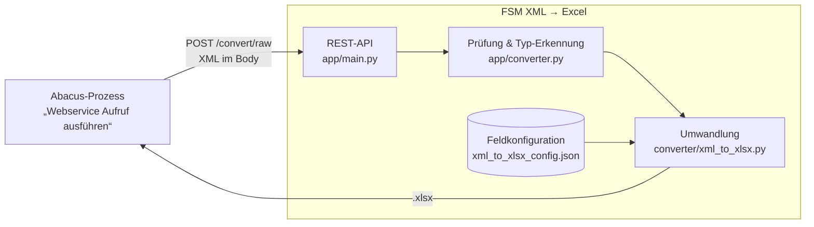

# FSM XML → Excel (REST-Service)

Wandelt die XML-Dateien aus dem **SAP Field Service Management (FSM) Connector** für Abacus
(`timeEfforts` = Zeiterfassungen, `expenses` = Spesen) in eine flache **Excel-Tabelle (.xlsx)** um.

Der Service nimmt eine XML-Datei per HTTP entgegen und schickt die fertige Excel-Datei direkt als Antwort
zurück. Er ist dafür gebaut, aus einem **Abacus-Prozess** (Baustein „Webservice Aufruf ausführen“)
aufgerufen zu werden, funktioniert aber mit jedem HTTP-Client.

**Repository:** <https://github.com/doodelidodo/fsm-xml-to-xlsx>

```
Abacus / Client  ──POST XML──►  FSM XML → Excel  ──►  .xlsx zurück (gleicher Dateiname)
```

- Eine Zeile pro Zeiterfassung bzw. Spesenposition; Werte aus den übergeordneten Ebenen
  (Serviceauftrag, Geschäftspartner, Aktivität, Verantwortliche) werden auf jede Zeile übernommen.
- Welche Spalten erzeugt werden, steht in einer **JSON-Konfiguration** und kann ohne Programmierung angepasst werden.
- Es werden **keine Daten gespeichert**: Die Excel-Datei entsteht im Arbeitsspeicher und wird direkt zurückgegeben.

---

## Inhalt

1. [Aufbau](#aufbau)
2. [Repository-Struktur](#repository-struktur)
3. [Betriebsvarianten](#betriebsvarianten)
4. [Schnellstart (lokal mit Docker)](#schnellstart-lokal-mit-docker)
5. [API](#api)
6. [Feldkonfiguration](#feldkonfiguration)
7. [Einstellungen](#einstellungen)
8. [Sicherheit und Datenschutz](#sicherheit-und-datenschutz)
9. [Weiterführende Anleitungen](#weiterführende-anleitungen)

---

## Aufbau



Der Service besteht aus drei Schichten:

| Schicht | Datei | Aufgabe |
|---|---|---|
| **REST-API** | `app/main.py` | HTTP-Endpunkte, API-Key-Prüfung, Grössenlimit, Antwort als Excel-Download |
| **Adapter** | `app/converter.py` | XML sicher prüfen (Schutz vor XXE), Typ erkennen (`timeEfforts`/`expenses`), Konfiguration laden, Umwandlung im Speicher aufrufen |
| **Konverter** | `converter/xml_to_xlsx.py` | Die eigentliche Umwandlungslogik (XML lesen, Felder gemäss Konfiguration auslesen, Excel schreiben). Funktioniert auch eigenständig als Kommandozeilen-Programm. |

Technik: Python 3.12, [FastAPI](https://fastapi.tiangolo.com/), [openpyxl](https://openpyxl.readthedocs.io/),
[defusedxml](https://github.com/tiran/defusedxml). Der gleiche Code läuft in allen Betriebsvarianten
(Docker, Windows-Dienst, AWS Lambda).

## Repository-Struktur

```
.
├── app/                        REST-API
│   ├── main.py                   Endpunkte
│   └── converter.py              Adapter zwischen API und Konverter
├── converter/                  Umwandlungslogik
│   ├── xml_to_xlsx.py            Konverter (auch als Kommandozeilen-Tool nutzbar)
│   └── xml_to_xlsx_config.json   Feldkonfiguration (welche Spalten)
├── samples/                    Anonymisierte Beispiel-XMLs (keine echten Daten)
├── docs/                       Anleitungen je Betriebsvariante, Abacus, Fehlersuche
├── windows/                    Betrieb als Windows-Dienst (ohne Docker)
│   ├── service.py                Dienst-Programm
│   ├── build-windows-service.ps1 baut die .exe
│   ├── install-service.ps1       installiert/aktualisiert den Dienst
│   ├── INSTALLATION.txt          Kurzanleitung, liegt in der ZIP für den Kundenserver
│   └── uninstall-service.ps1
├── Dockerfile                  Container (Docker, eigene Server, Azure Container Apps …)
├── docker-compose.yml          lokaler Start mit Docker
├── Dockerfile.lambda           Container-Variante für AWS Lambda
├── deploy-aws.ps1              Bereitstellung auf AWS Lambda (Zürich)
├── remove-aws.ps1              AWS-Ressourcen wieder entfernen
├── test.ps1                    schickt alle Beispiel-XMLs an einen laufenden Service
└── requirements.txt            Python-Abhängigkeiten
```

## Betriebsvarianten

| Variante | Geeignet wenn … | Kosten | Anleitung |
|---|---|---|---|
| **Windows-Dienst** | Abacus läuft auf einem Windows-Server (z.B. Azure-VM). Der Service läuft auf demselben Server und ist nur lokal erreichbar. | keine | [docs/betrieb-windows-dienst.md](docs/betrieb-windows-dienst.md) |
| **Docker** | Test auf dem eigenen Rechner, Linux-Server oder eine Container-Plattform (z.B. Azure Container Apps) | je nach Plattform | [docs/betrieb-docker.md](docs/betrieb-docker.md) |
| **AWS Lambda** | Der Service soll zentral im Internet erreichbar sein (HTTPS + API-Key), ohne eigenen Server | wenige Rappen pro Monat | [docs/betrieb-aws-lambda.md](docs/betrieb-aws-lambda.md) |

Die Einrichtung in Abacus ist für alle Varianten gleich, nur die Adresse unterscheidet sich:
[docs/abacus.md](docs/abacus.md).

## Schnellstart (lokal mit Docker)

Voraussetzung: [Docker Desktop](https://www.docker.com/products/docker-desktop/) läuft.

```powershell
git clone https://github.com/doodelidodo/fsm-xml-to-xlsx.git
cd fsm-xml-to-xlsx
docker compose up -d --build
```

Danach:

- **Swagger-Oberfläche:** <http://localhost:8000/docs>. Bei `POST /convert` auf *Try it out*, XML-Datei wählen, *Execute* und die Excel-Datei herunterladen.
- **Healthcheck:** <http://localhost:8000/health>
- **Alle Beispiel-XMLs umwandeln:** `.\test.ps1` → Ergebnisse in `output\`
- **Einzeln per Kommandozeile** (in PowerShell `curl.exe`, nicht `curl`):
  ```powershell
  curl.exe --data-binary "@samples\1001_20260911081138_timeEfforts.xml" `
    "http://localhost:8000/convert/raw?filename=1001_20260911081138_timeEfforts.xml" -o ergebnis.xlsx
  ```

Stoppen: `docker compose down` · Logs: `docker compose logs -f`

## API

Alle Endpunkte sind zusätzlich interaktiv unter `/docs` (Swagger) beschrieben.

### `POST /convert/raw` für Abacus

XML direkt als Request-Body. Das ist die Variante für den Abacus-Baustein und für andere Systeme.

| | |
|---|---|
| Body | Inhalt der XML-Datei (Content-Type beliebig, empfohlen `application/xml`) |
| Query `filename` | optional. Name der XML-Datei, bestimmt den Namen der Excel-Datei und hilft bei der Typ-Erkennung |
| Query `type` | optional. `timeEfforts` oder `expenses`; ohne Angabe automatisch |
| Header `X-API-Key` | nur nötig, wenn ein API-Key konfiguriert ist |

Falls der Aufrufer die Datei doch als Formular (`multipart/form-data`) schickt, wird die erste Datei daraus verwendet.

### `POST /convert` für Formular-Uploads

`multipart/form-data` mit dem Feld `file`. Das ist die Variante für Browser, Swagger-UI und `curl -F`. Query `type` wie oben.

### Antwort

- **200**: Excel-Datei (`application/vnd.openxmlformats-officedocument.spreadsheetml.sheet`)
  - `Content-Disposition`: Dateiname = Name der XML-Datei mit Endung `.xlsx`
  - `X-Record-Type`: `timeEfforts` oder `expenses`
  - `X-Row-Count`: Anzahl Zeilen
- **Fehler** als JSON `{"detail": "…"}`:

| Code | Bedeutung |
|---|---|
| 400 | Body leer, kein gültiges XML, unerlaubte XML-Konstrukte (DTD/Entities) oder unbekannter `type` |
| 401 | API-Key fehlt oder ist falsch |
| 413 | Datei grösser als erlaubt (`MAX_UPLOAD_MB`) |
| 422 | XML hat kein `<data>`-Element oder enthält keine Zeiterfassungen/Spesen |
| 500 | Feldkonfiguration fehlerhaft |

### Weitere Endpunkte

| Methode | Pfad | Zweck |
|---|---|---|
| GET | `/health` | Healthcheck, zeigt die verwendete Konfiguration |
| GET/POST | `/debug/echo` | Fehlersuche: zeigt als JSON, was beim Service ankommt (Header, Body-Grösse, Anfang des Bodys). Geschützt wie `/convert`. |
| GET | `/docs` | Swagger-Oberfläche |

### Typ-Erkennung

1. Parameter `type`, falls angegeben
2. Dateiname: enthält `expenses` → Spesen, enthält `timeEfforts` → Zeiterfassungen
3. Inhalt: gibt es `<activities>/<expenses>`, aber keine `<timeEfforts>` → Spesen, sonst Zeiterfassungen

## Feldkonfiguration

`converter/xml_to_xlsx_config.json` legt pro Typ fest, welche Spalten die Excel-Datei bekommt und woher die Werte stammen.

```json
{
  "profiles": {
    "timeEfforts": [
      {"name": "EventId",         "context": "root",       "path": "eventID"},
      {"name": "Subject",         "context": "data",       "path": "subject"},
      {"name": "ResponsibleCode", "context": "activity",   "path": "responsibles/code", "multiple": true},
      {"name": "StartDateTime",   "context": "timeEffort", "path": "startDateTime"}
    ],
    "expenses": [
      {"name": "ExpenseQuantity", "context": "expense",    "path": "udfValues/value", "index": 0}
    ]
  }
}
```

| Feld | Bedeutung |
|---|---|
| `name` | Spaltenüberschrift in Excel |
| `context` | Ebene im XML, von der aus `path` gesucht wird: `root` (ganze Nachricht), `data` (Serviceauftrag), `activity` (Aktivität), `timeEffort` bzw. `expense` (die einzelne Zeile) |
| `path` | Pfad zum Element, mit `/` getrennt, z.B. `businessPartner/code` |
| `multiple` | optional `true`: alle Vorkommen mit `; ` verbunden (z.B. mehrere Verantwortliche) |
| `index` | optional Zahl ab 0: nur das n-te Vorkommen (z.B. erster UDF-Wert) |

Pro `<timeEfforts>`- bzw. `<expenses>`-Element entsteht eine Zeile. Die erste Spalte `FileType` enthält immer den Typ.
Fehlt die Konfigurationsdatei, werden die im Konverter eingebauten Standardfelder verwendet.

Wo die Konfiguration im Betrieb liegt und ob Änderungen sofort wirken, hängt von der Variante ab:

| Variante | Datei | Änderung wirkt |
|---|---|---|
| Docker (compose) | `converter/xml_to_xlsx_config.json` (eingebunden) | sofort |
| Windows-Dienst | `C:\Program Files\FsmXmlToXlsx\xml_to_xlsx_config.json` | sofort |
| AWS Lambda | im Image eingebaut | nach erneutem `deploy-aws.ps1` |

### Kommandozeilen-Variante

Der Konverter funktioniert auch ohne Service: `converter/xml_to_xlsx.py` wandelt alle `.xml`-Dateien im
eigenen Ordner in `.xlsx` um (liest die Konfiguration aus demselben Ordner). Mit PyInstaller lässt er sich zu einer
eigenständigen `.exe` packen (`pyinstaller --onefile xml_to_xlsx.py`).

## Einstellungen

Umgebungsvariablen für Docker und AWS (beim Windows-Dienst stehen sie in `settings.json`, siehe
[Anleitung](docs/betrieb-windows-dienst.md)):

| Variable | Standard | Bedeutung |
|---|---|---|
| `API_KEY` | leer | Wenn gesetzt, muss jeder Aufruf von `/convert*` und `/debug/echo` den Header `X-API-Key` mit diesem Wert mitschicken |
| `MAX_UPLOAD_MB` | `20` (AWS: `5`) | Maximale Grösse der XML-Datei |
| `LOG_LEVEL` | `INFO` | `DEBUG`, `INFO`, `WARNING`, … |
| `CONFIG_PATH` | `/config/xml_to_xlsx_config.json` | Pfad zur Feldkonfiguration |

## Sicherheit und Datenschutz

- **Personendaten:** Die XML-Dateien enthalten Zeiten und Spesen von Mitarbeitenden sowie Kundenadressen.
  Der Service **speichert keine Inhalte**: XML und Excel existieren nur während der Anfrage im Arbeitsspeicher.
  In den Logs stehen nur Dateiname, Typ, Zeilenzahl und technische Header, keine Inhalte.
- **XML-Angriffe:** Jede Datei wird zuerst mit `defusedxml` geprüft. DTDs und Entities (XXE, „Billion Laughs“) werden abgelehnt.
- **Zugriffsschutz:** Optionaler API-Key (Header `X-API-Key`, zeitkonstanter Vergleich). Pflicht, sobald der Service
  über das Netzwerk erreichbar ist. Im Internet nur über HTTPS betreiben (bei AWS automatisch).
- **Windows-Dienst:** hört standardmässig nur auf `127.0.0.1`, ist also von aussen nicht erreichbar.
- **Docker:** Container läuft als Benutzer ohne Root-Rechte.
- **Standort:** Die AWS-Variante läuft in der Region Zürich (`eu-central-2`), die Daten verlassen die Schweiz nicht.
- **Echte Daten nicht einchecken:** `.gitignore` erlaubt XML/Excel nur im Ordner `samples/`. Die Beispiele dort sind anonymisiert.

## Weiterführende Anleitungen

- [Einrichtung in Abacus](docs/abacus.md)
- [Betrieb als Windows-Dienst](docs/betrieb-windows-dienst.md)
- [Betrieb mit Docker](docs/betrieb-docker.md)
- [Betrieb auf AWS Lambda](docs/betrieb-aws-lambda.md)
- [Fehlersuche](docs/fehlersuche.md)
