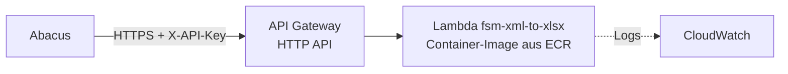

# Betrieb auf AWS Lambda

Der Service läuft als AWS-Lambda-Funktion (Container-Image) in der Region **Zürich (`eu-central-2`)** und ist über
eine öffentliche **HTTPS-Adresse mit API-Key** erreichbar. Es gibt keinen Server, der gewartet werden muss.
Bezahlt wird nur pro Aufruf; bei einigen tausend Umwandlungen pro Monat sind das wenige Rappen.



`deploy-aws.ps1` richtet alles mit einem Befehl ein und aktualisiert es bei jedem weiteren Aufruf.

## Voraussetzungen (einmalig)

1. **Docker Desktop** läuft.
2. **AWS CLI v2** installieren, danach PowerShell neu öffnen:
   ```powershell
   msiexec.exe /i https://awscli.amazonaws.com/AWSCLIV2.msi
   aws --version
   ```
3. **Zugang einrichten:** In der AWS-Konsole unter IAM einen Benutzer (z.B. `deploy-cli`) mit der Richtlinie
   `AdministratorAccess` anlegen, unter *Sicherheitsanmeldeinformationen* einen Zugriffsschlüssel für die
   *Befehlszeilenschnittstelle (CLI)* erstellen und eintragen:
   ```powershell
   aws configure          # Region: eu-central-2, Format: json
   aws sts get-caller-identity
   ```
4. **Region Zürich aktivieren:** Zürich ist eine „Opt-in“-Region und muss im Konto einmal aktiviert werden
   (Konsole → Konto → AWS-Regionen → Europa (Zürich) → Aktivieren, oder
   `aws account enable-region --region-name eu-central-2 --region us-east-1`). Solange sie nicht aktiv ist, meldet
   AWS irreführend `InvalidClientTokenId`.

### Hinweis zu neuen AWS-Konten („Idea Launchpad“ / Free Plan)

Konten, die über die neue, vereinfachte AWS-Registrierung erstellt wurden, liegen in einer von AWS verwalteten
Organisation mit Einschränkungen (Service Control Policies): nur wenige Regionen, gesperrte Aktionen. Für den Betrieb:

1. Auf den **Paid Plan** wechseln (<https://settings.aws.com> → Billing → Upgrade). Es gibt keine Grundgebühr.
   Im Free Plan wird das Konto nach 6 Monaten geschlossen.
2. **Erweiterte Funktionen aktivieren** (<https://settings.aws.com> → Projects → Explore advanced features).
   Das lässt sich nicht rückgängig machen.
3. Im Verwaltungskonto der Organisation unter **AWS Organizations → Richtlinien → Service-Kontrollrichtlinien** die
   Richtlinie `AdvancedModeRegionRestrictionSecurityControlPolicy` bearbeiten und im Abschnitt `RegionFloor`
   die Region `"eu-central-2"` ergänzen.

Fehlermeldungen mit `explicit deny in a service control policy` deuten immer auf diesen Punkt hin.

## Bereitstellen und aktualisieren

```powershell
cd <Repository>
powershell -ExecutionPolicy Bypass -File .\deploy-aws.ps1
```

Das Script

1. legt ein **ECR-Repository** an (hält die letzten 10 Images),
2. baut das Image aus `Dockerfile.lambda` und lädt es hoch,
3. legt eine **IAM-Rolle** an, die nur Logs schreiben darf,
4. legt die **Lambda-Funktion** an (512 MB, 30 s Timeout) bzw. aktualisiert sie,
5. richtet die **öffentliche HTTPS-Adresse** ein. In Regionen mit *Lambda Function URLs* wird diese verwendet
   (kostenlos). In Zürich gibt es Function URLs nicht, dann legt das Script automatisch ein **API Gateway (HTTP API)**
   an (ca. 1 USD pro Million Aufrufe),
6. erzeugt beim ersten Mal einen **API-Key** und speichert ihn in `.aws-api-key.txt` (nicht einchecken, steht in `.gitignore`).

Am Ende stehen Adresse und Testbefehl in der Ausgabe, z.B.:

```
Service online:  https://abc123xyz.execute-api.eu-central-2.amazonaws.com
```

Jeder weitere Aufruf von `deploy-aws.ps1` baut neu und aktualisiert nur Code und Konfiguration. Adresse und
API-Key bleiben gleich.

| Parameter | Wirkung |
|---|---|
| `-Region eu-central-1` | andere Region (Standard `eu-central-2`) |
| `-ApiKey "…"` | neuen API-Key setzen (danach in Abacus anpassen) |
| `-Profile kunde-x` | anderes AWS-CLI-Profil, z.B. für das Konto eines Kunden |
| `-MemoryMb 1024` / `-TimeoutSeconds 60` | mehr Speicher / längere Laufzeit |

**Feldkonfiguration:** Auf Lambda ist `converter/xml_to_xlsx_config.json` ins Image eingebaut. Nach einer Änderung
`deploy-aws.ps1` erneut ausführen.

## Testen

```powershell
.\test.ps1 -BaseUrl https://<id>.execute-api.eu-central-2.amazonaws.com -ApiKey (Get-Content .aws-api-key.txt)
```

## Betrieb

| Aufgabe | Befehl / Ort |
|---|---|
| Logs live | `aws logs tail /aws/lambda/fsm-xml-to-xlsx --follow --region eu-central-2` |
| Logs in der Konsole | CloudWatch → Protokollgruppen → `/aws/lambda/fsm-xml-to-xlsx` |
| API-Key anzeigen | `Get-Content .aws-api-key.txt` |
| Kostenschutz | Konsole → Billing → Budgets, z.B. 5 USD/Monat mit E-Mail-Warnung |
| Alles entfernen | `powershell -ExecutionPolicy Bypass -File .\remove-aws.ps1` (fragt nach) |

## Grenzen

- Request und Antwort je max. 6 MB (Lambda); Uploads sind auf 5 MB begrenzt.
- Max. 30 s pro Aufruf (API Gateway).
- Nach längerer Pause dauert der erste Aufruf 1–2 s länger (Kaltstart).
