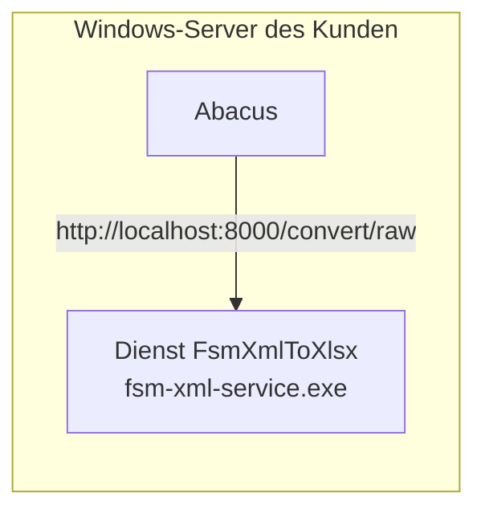

# Betrieb als Windows-Dienst

Für Kundenserver, auf denen Abacus unter Windows läuft, z.B. eine Azure-VM. Der Service läuft als normaler
Windows-Dienst direkt auf dem Abacus-Server:

- kein Docker, kein Linux, auf dem Zielserver auch kein Python nötig
- startet automatisch mit Windows und wird bei einem Absturz automatisch neu gestartet
- standardmässig **nur lokal erreichbar** (`127.0.0.1`), Abacus ruft `http://localhost:8000/convert/raw` auf
- keine Daten verlassen den Server



## 1. Bauen (einmalig pro Version, auf einem Entwicklungsrechner)

Voraussetzung: Python 3.11 oder neuer (`py --version`) und Git.

```powershell
git clone https://github.com/doodelidodo/fsm-xml-to-xlsx.git
cd fsm-xml-to-xlsx\windows
powershell -ExecutionPolicy Bypass -File .\build-windows-service.ps1
```

Das Script legt eine eigene Build-Umgebung an (`windows\.build-venv`), installiert die Abhängigkeiten und baut mit
PyInstaller den Ordner **`windows\dist\fsm-xml-service\`** (Programm + alles, was es braucht + Feldkonfiguration).

Schnelltest im Konsolenfenster, beenden mit Ctrl+C:

```powershell
.\dist\fsm-xml-service\fsm-xml-service.exe run
```

Läuft bereits etwas auf Port 8000 (z.B. der Docker-Container: `docker compose down`), vorher stoppen oder in
`dist\fsm-xml-service\settings.json` einen anderen Port eintragen.

Am Ende erzeugt das Script zusätzlich das Installationspaket
**`windows\release\fsm-xml-service-<version>.zip`** (Programm, Installations-Scripts, Kurzanleitung).

## 2. Auf den Server bringen

Nur die ZIP-Datei auf den Kundenserver kopieren und entpacken, z.B. nach `C:\Install\fsm-xml-service`:

```
C:\Install\fsm-xml-service\
├── dist\fsm-xml-service\      Programm
├── install-service.ps1
├── uninstall-service.ps1
└── INSTALLATION.txt            Kurzanleitung
```

## 3. Installieren

PowerShell **als Administrator** öffnen:

```powershell
cd C:\Install\fsm-xml-service
powershell -ExecutionPolicy Bypass -File .\install-service.ps1
```

Das Script

1. kopiert das Programm nach `C:\Program Files\FsmXmlToXlsx`,
2. legt `settings.json` an (bestehende Einstellungen und Feldkonfiguration bleiben bei einem Update erhalten),
3. richtet den Dienst **`FsmXmlToXlsx`** („FSM XML to XLSX Service“) mit automatischem Start und automatischem Neustart bei Fehlern ein,
4. startet ihn und prüft `http://localhost:<port>/health`.

Optionen:

| Parameter | Wirkung |
|---|---|
| `-Port 8001` | anderer Port |
| `-ApiKey "…"` | API-Key setzen (Header `X-API-Key` wird Pflicht) |
| `-ListenAll` | auch von anderen Rechnern erreichbar (`0.0.0.0`) und Firewall-Regel anlegen. **Nur mit `-ApiKey` verwenden.** |
| `-InstallDir "D:\Apps\FsmXmlToXlsx"` | anderer Installationsordner |

## Einstellungen: `settings.json`

Im Installationsordner (Standard `C:\Program Files\FsmXmlToXlsx\settings.json`):

```json
{
  "host": "127.0.0.1",
  "port": 8000,
  "api_key": "",
  "config_path": "xml_to_xlsx_config.json",
  "log_level": "INFO"
}
```

| Feld | Bedeutung |
|---|---|
| `host` | `127.0.0.1` = nur lokal; `0.0.0.0` = aus dem Netzwerk erreichbar (dann Firewall und API-Key!) |
| `port` | Port |
| `api_key` | leer = kein Key nötig |
| `config_path` | Feldkonfiguration, relativ zum Installationsordner oder absolut |
| `log_level` | `INFO`, `DEBUG`, … |

Nach Änderungen an `settings.json` den Dienst neu starten:
```powershell
Restart-Service FsmXmlToXlsx
```
Änderungen an der **Feldkonfiguration** (`xml_to_xlsx_config.json`) wirken sofort, ohne Neustart.

## Betrieb

| Aufgabe | Befehl / Ort |
|---|---|
| Status | `Get-Service FsmXmlToXlsx` oder `services.msc` |
| Neu starten | `Restart-Service FsmXmlToXlsx` (als Administrator) |
| Logs | `C:\Program Files\FsmXmlToXlsx\logs\service.log` (rotiert, max. 6 × 5 MB) |
| Startfehler | zusätzlich Ereignisanzeige → Windows-Protokolle → Anwendung |
| Update | neue ZIP bauen, auf dem Server entpacken, `install-service.ps1` erneut ausführen |
| Entfernen | `uninstall-service.ps1` (als Administrator); mit `-RemoveFiles` auch den Programmordner |

## Hinweise

- Die `.exe` ist nicht signiert. Virenscanner oder SmartScreen können beim ersten Start nachfragen oder, bei strengen
  Richtlinien, den Start blockieren. In dem Fall den Installationsordner freigeben oder die `.exe` signieren.
- Für einen Test auf dem eigenen Rechner vorher einen laufenden Docker-Container auf Port 8000 stoppen.
